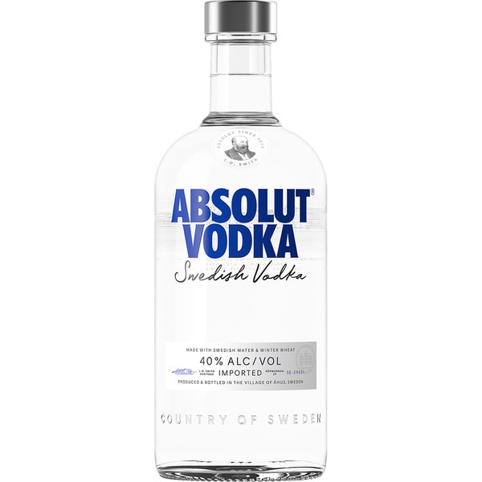
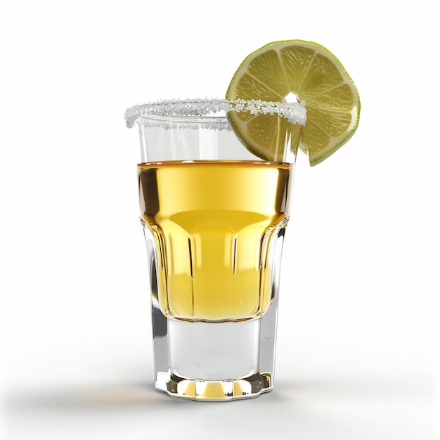
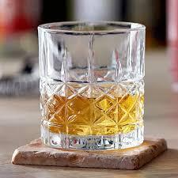

Los destilados han tenido un papel importante en la historia de diversas culturas alrededor del mundo. Desde el whisky escocés hasta el tequila mexicano, estas bebidas han evolucionado y adquirido un simbolismo único en sus regiones de origen.

Aquí hablaremos sobre algunos destilados icónicos y su historia breve:

### Vodka
Originado en Rusia y Polonia, el vodka tiene una historia que se remonta a varios siglos. Originalmente utilizado como medicina, se popularizó en la cultura europea y más tarde en todo el mundo. Su sabor neutro lo convierte en un ingrediente ideal para cócteles.

> "La palabra vodka se deriva del término eslavo 'voda', que significa agua, reflejando su apariencia clara y sin color."

### Tequila
El tequila es una bebida tradicional de México, hecha a partir de la fermentación y destilación del agave azul. Originario del estado de Jalisco, esta bebida se ha convertido en un emblema de la cultura mexicana en todo el mundo.

> "El tequila tiene una Denominación de Origen que protege su proceso de elaboración y asegura su autenticidad."

### Whisky
El whisky, particularmente el escocés, es una de las bebidas más antiguas de Europa. Con un proceso de envejecimiento en barricas de roble, adquiere un sabor característico que depende de la región y el método de destilación.

> "El whisky escocés debe envejecer un mínimo de tres años para cumplir con los estándares de calidad de Escocia."
