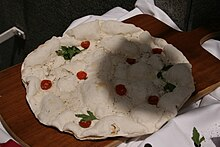

Algunas de las comidas más reconocidas a nivel global esconden originales historias en su origen. A contrario de lo que puedas pensar, por ejemplo, la hamburguesa no nació en Estados Unidos, y el croissant podría haber nacido en Budapest. Por eso vamos a repasar esas historias que a mi parecer soin un tanto curiosas.

### La Pizza
La pizza nació en Nápoles como una comida sencilla para los pobres, hecha con pan, sal y aceite. En 1889, el chef Raffaele Esposito creó la **Pizza Margarita** con tomate, mozzarella y albahaca, representando los colores de la bandera italiana en honor a la reina Margarita. Los emigrantes italianos luego llevaron la pizza a Estados Unidos, donde se volvió muy popular.

### La Hamburguesa
La hamburguesa, a pesar de su fama en Estados Unidos, se originó en Hamburgo, Alemania, como un filete de carne picada. En el siglo XIX, marineros alemanes llevaron esta receta a América, y la primera "hamburguesa" apareció en Nueva York en 1834.

### El Croissant
Aunque el croissant es un símbolo de Francia, se dice que tiene origen en Budapest en 1686. La leyenda cuenta que panaderos locales ayudaron a frustrar un ataque turco y, como recompensa, crearon un pan en forma de medialuna. La primera receta de croissant en Francia apareció en 1905.
